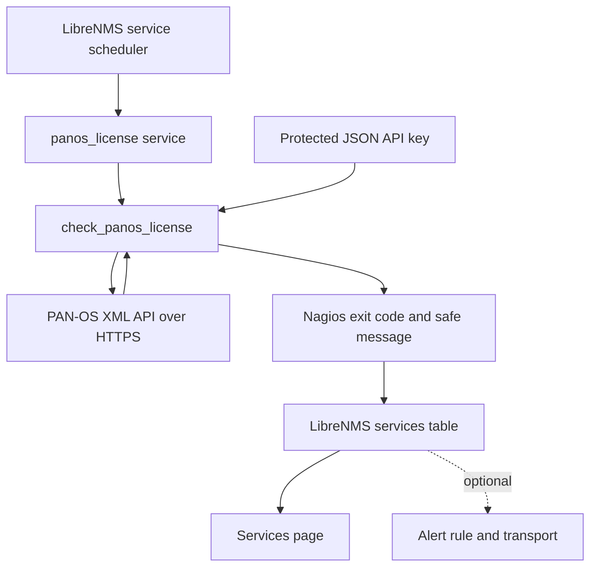

# Architecture

## End-to-end flow



## Components

| Component | Purpose |
|---|---|
| LibreNMS service scheduler | Executes enabled services, normally every five minutes |
| Service record | Associates the `panos_license` check with one LibreNMS device |
| `check_panos_license` | Queries, parses, evaluates, and formats licence status |
| Per-device JSON | Stores the API destination and key outside Git and the LibreNMS database |
| PAN-OS XML API | Returns the output of `request license info` |
| LibreNMS database | Stores the latest exit code, message, and state-change time |
| Services page | Displays the stored result; opening the page does not trigger the API request |

## API request

The plugin submits this exact PAN-OS operational command:

```xml
<request><license><info/></license></request>
```

The HTTPS POST contains:

```text
type=op
cmd=<request><license><info/></license></request>
```

The API key is sent in the `X-PAN-KEY` header. The key is never included in the
plugin's output.

## Parsing

PAN-OS versions can return licence information in either:

- structured XML `<entry>` elements; or
- CLI-style text inside the XML `<result>` element.

The checker supports both. It extracts only:

- feature name;
- expiry date;
- expired flag.

Serial numbers and Authcodes present in the API response are ignored.

## State calculation

The checker evaluates every expiring licence and returns the most severe state.

```text
expired or <= critical threshold → CRITICAL
<= warning threshold             → WARNING
otherwise                        → OK
execution/parsing failure        → UNKNOWN
```

Perpetual licences are counted but excluded from date-based thresholds.

## Separation from other LibreNMS functions

This checker is independent of:

- SNMP polling;
- SNMPv3 Engine IDs;
- SNMP traps and `snmptrapd`;
- LibreNMS device discovery;
- alert-email templates.

The PAN-OS device should already exist in LibreNMS, but the licence status comes
from HTTPS API polling rather than SNMP.

